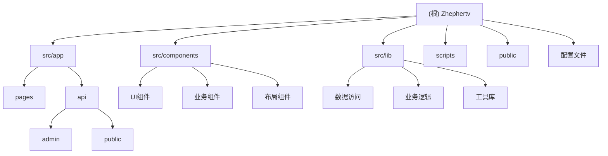

# Zhephertv - 视频流媒体聚合平台

> 基于 Next.js 14 的现代视频流媒体平台，集成多源搜索、直播电视、短剧、AI推荐等功能

## 变更记录 (Changelog)

### 2025-09-28 17:17:51
- 🚀 **初始化项目架构文档**
- 📊 **完成模块结构分析**：识别出 6 个主要功能模块
- 📝 **生成全面技术文档**：覆盖架构、API、组件、库等关键模块

---

## 项目愿景

Zhephertv (又名 MoonTV) 是一个全功能的视频流媒体聚合平台，旨在为用户提供统一的影视内容搜索、观看和管理体验。平台整合了多个视频源、直播电视、短剧内容，并集成了AI智能推荐、豆瓣评分、用户收藏等丰富功能。

**核心特性：**
- 🔍 多源影视内容聚合搜索
- 📺 IPTV直播电视支持
- 🎬 短剧专区与推荐
- 🤖 AI智能推荐系统
- 👤 用户系统与权限管理
- 📊 播放统计与数据分析
- 🎨 响应式现代化界面
- ⚡ PWA支持，支持移动端安装

## 架构总览

Zhephertv 采用现代全栈架构，基于 Next.js 14 App Router 构建：

**技术栈：**
- **前端框架**：Next.js 14 (App Router) + React 18
- **样式方案**：Tailwind CSS + Framer Motion
- **状态管理**：React Hooks + Context API
- **数据存储**：Redis (多种实现：Upstash, KVRocks)
- **媒体播放**：ArtPlayer + HLS.js + Vidstack
- **UI组件**：Headless UI + Lucide Icons + React Icons
- **开发工具**：TypeScript + ESLint + Prettier + Husky
- **测试框架**：Jest + Testing Library
- **部署方案**：Docker + Vercel

**架构特点：**
- 🏗️ **单体架构**：所有功能模块集成在一个 Next.js 应用中
- 🔄 **API路由分层**：前台API与管理员API分离
- 🧩 **组件化设计**：高度复用的React组件库
- 🛡️ **权限分级**：用户/管理员/站长三级权限体系
- 📦 **模块化库**：业务逻辑封装在独立的lib模块中

## 模块结构图



## 模块索引

| 模块路径 | 模块名称 | 主要职责 | 语言 | 状态 |
|---------|----------|----------|------|------|
| `src/app` | 前端应用模块 | Next.js App Router页面与API路由 | TypeScript | ✅ 活跃 |
| `src/components` | 组件模块 | React可复用组件库 | TypeScript | ✅ 活跃 |
| `src/lib` | 核心库模块 | 业务逻辑、数据访问、工具函数 | TypeScript | ✅ 活跃 |
| `scripts` | 构建脚本模块 | 构建工具与部署脚本 | JavaScript | ✅ 活跃 |
| `public` | 静态资源模块 | 图标、图片、静态文件 | 静态文件 | ✅ 稳定 |
| `/` | 根配置模块 | 项目配置、依赖管理、构建配置 | JSON/JS | ✅ 稳定 |

## 运行与开发

### 环境要求
- Node.js 18+
- pnpm 8+
- Redis 服务 (可选：使用Upstash云服务)

### 快速开始
```bash
# 安装依赖
pnpm install

# 开发模式
pnpm dev

# 构建生产版本
pnpm build
pnpm start

# 代码检查与格式化
pnpm lint
pnpm format

# 运行测试
pnpm test
```

### 环境变量配置
主要环境变量（详见 `.env.example`）：
- `NEXT_PUBLIC_SITE_NAME`: 站点名称
- `NEXT_PUBLIC_STORAGE_TYPE`: 存储类型 (localstorage/redis)
- `USERNAME/PASSWORD`: 初始管理员账号
- `REDIS_URL`: Redis连接字符串
- `TMDB_API_KEY`: TMDB API密钥（可选）

## 测试策略

### 测试架构
- **单元测试**：Jest + Testing Library
- **组件测试**：React组件快照与交互测试
- **类型检查**：TypeScript严格模式
- **代码质量**：ESLint + Prettier

### 测试覆盖范围
- ✅ 配置文件语法检查
- ✅ TypeScript类型安全
- ⚠️ **待完善**：组件单元测试
- ⚠️ **待完善**：API端点集成测试
- ⚠️ **待完善**：数据层测试

### 测试命令
```bash
# 运行测试套件
pnpm test

# 监听模式
pnpm test:watch

# 类型检查
pnpm typecheck

# 代码风格检查
pnpm lint:strict
```

## 编码规范

### TypeScript规范
- 使用严格的TypeScript配置
- 所有API接口必须有明确的类型定义
- 优先使用接口(interface)而非类型别名(type)
- 避免使用 `any`，使用具体类型或泛型

### React组件规范
- 功能组件优于类组件
- 自定义Hooks用于逻辑复用
- Props接口统一放在组件文件顶部
- 使用 `React.FC` 类型标注（可选）

### API设计规范
- RESTful API路径设计
- 统一的响应格式 `{ code, data, message }`
- 错误处理与状态码规范
- 请求参数验证与类型安全

### 样式规范
- Tailwind CSS工具类优先
- 避免内联样式，使用CSS Modules或styled-components
- 响应式设计（移动端优先）
- 暗色模式支持

## AI 使用指引

### 代码理解建议
1. **先读配置**：从 `package.json`、`tsconfig.json` 开始理解项目结构
2. **理解架构**：查看 `src/app/layout.tsx` 了解应用入口和全局配置
3. **API优先**：先理解 `src/app/api` 路由结构，再看前端页面
4. **类型驱动**：重点关注 `src/lib/types.ts` 和 `src/lib/admin.types.ts`
5. **配置管理**：理解 `src/lib/config.ts` 中的配置管理机制

### 开发任务指引

#### 新增功能模块
1. 在 `src/lib` 中添加数据访问和业务逻辑
2. 在 `src/app/api` 中添加API端点
3. 在 `src/components` 中添加UI组件
4. 在 `src/app` 中添加页面路由
5. 更新类型定义和文档

#### 修改现有功能
1. 先查找相关的类型定义
2. 理解数据流：页面 → API → 库函数 → 数据层
3. 检查权限控制和错误处理
4. 确保响应式设计和暗色模式兼容

#### 调试问题
1. 检查浏览器控制台和Network面板
2. 查看服务端日志 (dev模式下的控制台输出)
3. 验证环境变量配置
4. 检查Redis连接和数据结构

### 常见开发任务

**添加新的视频源**：
- 修改 `src/lib/config.ts` 中的源配置
- 适配 `src/lib/downstream.ts` 中的搜索逻辑
- 更新管理后台源管理界面

**新增API端点**：
- 在 `src/app/api/` 下创建路由文件
- 实现标准的错误处理和认证
- 更新API类型定义

**UI组件开发**：
- 参考现有组件的设计模式
- 确保响应式和暗色模式支持
- 遵循无障碍性标准

**数据库操作**：
- 使用 `src/lib/db.ts` 中的统一数据访问接口
- 注意缓存策略和过期机制
- 考虑数据迁移和向后兼容性